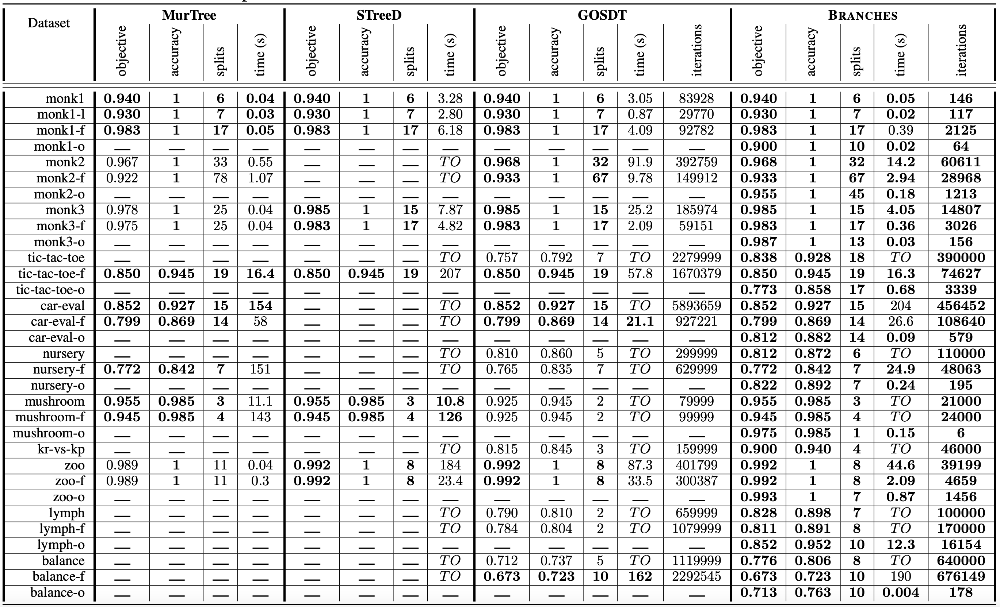

# Branches: Efficiently Seeking Optimal Sparse Decision Trees with AO*

Source code for the Algorithm Branches described in [Branches: Efficiently Seeking Optimal Sparse Decision Trees with AO*](https://arxiv.org/abs/2406.02175).

## Dependencies

We recommend creating a conda virtual environment from our .yml file as follows:
```
conda env create -f dependencies.yml
conda activate branches
```
To visualize Decision Trees, we need the svgling package, which is not currenlty supported by conda. Thus we install it with pip:
```
pip install svgling
```

## Repository Structure
    .
    ├── data                         # Data used for benchmarking.
    │   └── preprocessed             # Text files containing the preprocessed data.
    │       └── preprocessing.py     # .py script preprocessing the data.
    ├── results                      # Results of the experiments.
    │   └── experiments.csv          # .csv file summarising the main experiments.
    ├── src                          # Source files.
    │   ├── branch_ordinal.py        # Source file for classification problems with ordinally encoded data.
    │   ├── branch_binary.py         # Source file for binary classification problems with binary data.
    │   ├── branch_binary_multi.py   # Source file for classification problems with binary data.
    │   ├── branches.py              # Source file for the Branches algorithm.
    │   ├── experiments.py           # Source file for running the main experiments.
    │   ├── train.py                 # Source file for training Branches.
    │   └── tutorial.ipynb           # Tutorial .ipynb notebook.
    ├── trees                        # SVG files of optimal sparse decision trees.
    ├── Tables.png                   # PNG file containing a summary of empricial comparisons.
    ├── dependencies.yml
    ├── LICENSE
    └── README.md

## Example of usage

The [MONK's Problems](https://archive.ics.uci.edu/dataset/70/monk+s+problems) are standard datasets for benchmarking Optimal Decision Trees algorithms. We use the first of these problems to illustrate how to use Branches.

```python
from branches import *
from sklearn.preprocessing import OneHotEncoder, OrdinalEncoder, LabelEncoder

# Reading the data
data = np.genfromtxt('data/monks-1.train', delimiter=' ', dtype=int)
data = data[:, :-1] # Getting rid of the last column, it contains only ids.
data = data[:, ::-1] # Reorder the columns to put the predicted variable Y at the end.

# Ordinal Encoding of the data
encoder = OrdinalEncoder()
encoder.fit(data)
data = encoder.transform(data).astype(int)

# Running Branches
alg = Branches(data)
alg.solve(lambd=0.01)

# Printing the accuracy, number of branches and number of splits
branches, splits = alg.lattice.infer()
print('Number of branches :', len(branches))
print('Number of splits :', splits)
print('Accuracy :', ((alg.predict(data[:, :-1]) == data[:, -1]).sum())/alg.n_total)
```

Using the nltk and svgling packages, we can plot the optimal sparse Decision Tree via the code below. $\color{red}{\textsf{If you do not see the figures, it is due to a contrast issue and you should set a light theme for Github.}}$

```python
tree = alg.plot_tree(show_classes=False)
svgling.draw_tree(tree)
```


This figure does not include the predictions at the level of the leaves. To show these, set ```show_classes=True``` in the plot_tree method.

```python
tree = alg.plot_tree(show_classes=True)
svgling.draw_tree(tree)
```


Some nodes exhibit the same subtrees, which makes this representation a little redundant. To compactify it, set ```compact=True``` in the plot_tree method.

```python
tree = alg.plot_tree(show_classes=True, compact=True)
svgling.draw_tree(tree)
```


The tutorial notebook ```src/tutorial.ipynb``` contains more examples on how to use Branches, especially with its micro-optimisation techniques that allow for significant computational gains.

## Training from the command line

The file ```src/train.py``` allows training (fitting) Branches on data from the command line as per the example below.

```
cd src
python train.py --path '../data/preprocessed/monk1.txt' --lambd 0.01 --encoding binary --path_tree ../trees/monk1-tree.svg
```

The script prints a summary that includes the objective, accuracy, number of splits and depth of the retrieved solution, along with the number of iterations and the runtime of Branches to terminate. The script also saves an SVG file of the solution in ```trees/monk1-tree.svg``` . The arguments are documented in ```src/train.py```.

### Important note:

Script ```src/train.py``` processes data that has been processed in a specific manner. 
- The data is a .txt file.
- The last column must be the predicted variable.
- The data has been encoded and includes integers only.
- The data is delimited with ' '.

```data/preprocessed/preprocessing.py``` preprocesses the data employed in our experiments and saves it in ```data/preprocessed/```.

To run the main experiments, use:

```
cd src
python experiments.py
```

The results are summarised and saved in ```results/experiments.csv```.

## Empirical Evaluation

Branches optimises the regularised accuracy $\mathcal{H}_{\lambda}\left( T\right) = \textrm{Accuracy}\left( T\right) - \lambda \mathcal{S}\left( T\right)$, where $\mathcal{S}\left( T\right)$ is the number of splits (internal nodes) of Decision Tree $T$ and $\lambda \in \left] 0, 1 \right[$ is a penalty parameter. The table below summarises the empirical comparison between Branches and the state of the art. For more information about the experimental setup, please refer to Section 5 and Appendix H in [Branches: Efficiently Seeking Optimal Sparse Decision Trees via AO*](https://arxiv.org/abs/2406.02175) .

<p align="center">

</p>


